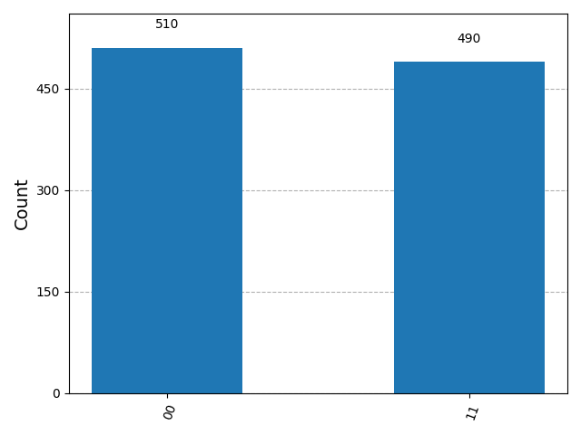

# Qiskit Security Lab

Qiskit-based quantum computing demos illustrating randomness, superposition, and entanglement, with relevance to future cryptography and security.
<p align="center">
  
</p>
<p align="center">
  Bell state measurement showing expected entanglement (~50/50 distribution)
</p>
---

## 🚀 Overview

This project demonstrates core quantum computing concepts using Qiskit and AerSimulator.

Focus areas:
- Quantum randomness
- Superposition
- Entanglement (Bell states)
- Probabilistic measurement

The goal is to provide a practical, code-based introduction to ideas that are expected to impact future encryption systems.

---

## 📂 Project Structure

- `random_generator.py`  
  Quantum random number generator using superposition

- `bell_state_demo.py`  
  Demonstrates entanglement and outputs a measurement histogram

- `plots/`  
  Contains generated visualization output

---

## ⚙️ Installation

```bash
python3 -m venv qiskit-env
source qiskit-env/bin/activate
pip install -r requirements.txt
